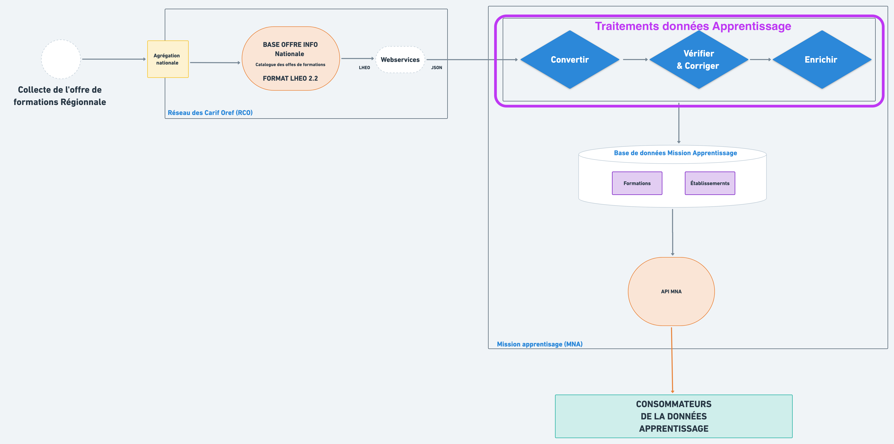
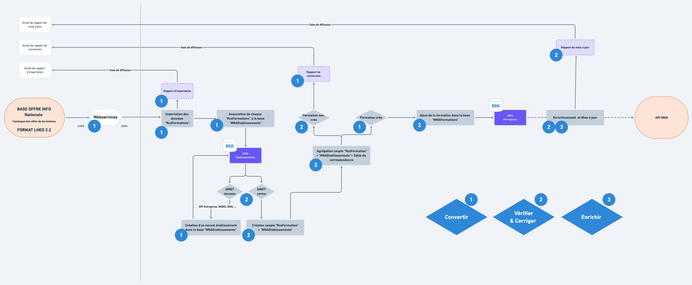

# Traitements sur la données pour l'Apprentissage

Ce chapitre décrit les traitements permettant de **vérifier, corriger et enrichir** la donnée provenant des Carif-Oref régionale.  
  
Pour des besoins de lisibilité dans ce chapitre, ci-dessous le diagramme simplifié centré autour des traitements de données :

### Flux de traitements et découpage \(à refaire\)

Vous trouverez les détails de chaque traitements dans les pages suivantes : 





