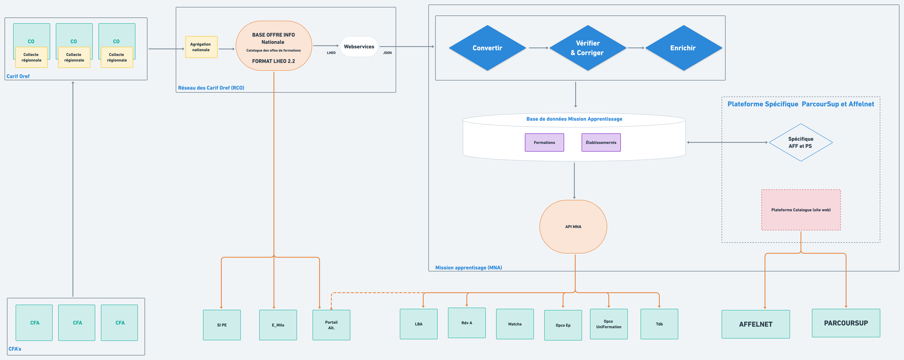

# Vue d’ensemble simplifiée

Ci-dessous, vous pourrez retrouver une vue d'ensemble "macro" \(très haut niveau\) des blocs fonctionnels composants le "catalogue" au 1 Juillet 2021. 

### Acteurs principaux 

#### CFA - Centre de formation d'apprentis

// todo

#### CO - Carif Oref

// todo

#### RCO - Réseau des Carif Oref 

// todo

#### MNA - Mission National Apprentissage

// todo

### Consommateurs 

#### ParcourSup

// todo

#### Affelnet

// Todo

--------------------------------------------------------------------------------------------------

Le contexte l’apprentissage impose une certaine quantité de vérifications ainsi que de précision sur la données de formation et d'établissements. Ainsi afin de facilité la consommation de l'offre de formation et des informations établissements du catalogue, la MNA effectue une série de traitements décrit dans le prochain chapitre. \([Traitements sur la données pour l'apprentissage](traitements-sur-la-donnees-pour-lapprentissage-en-cours/)\) 

