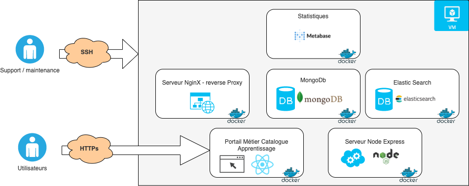

# Architecture technique

### Vue d'ensemble

### Architecture

####   Front

* React JS

####  Back

* Server/ API : Node JS
* Base de données : MongoDB
* Moteur de recherche: Elastic Search
* Statistique: Metabase
* Reverse Proxy: Nginx

